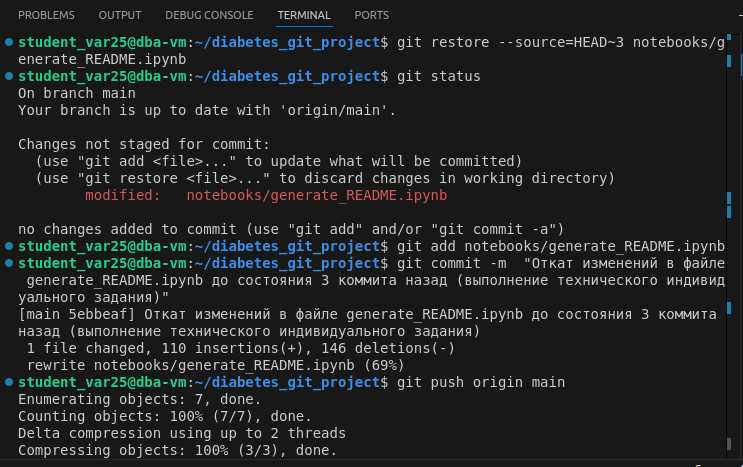

# Лабораторная работа 1. Работа с Git и Github. Выполнила Савкина Мария, вариант 25.

## Описание бизнес-задачи.
Выявление групп риска диабета путём описания признаков пациентов в файле README.md. Признаки описаны в таблице ниже. Файл .ipynb для генерации README.md файла находится в папке notebooks. 

## Структура проекта.

Использован дата-сет Diabetes Dataset.

Проект состоит из трех папок data, notebooks и src.
data - дата-сет diabetes.csv
notebooks - файл .ipynb, решающий задание индивидуального варианта
src - скрипты

# Решение индивидуального задания Вариант 25:

## Описание данных
- **Количество записей:** 768
- **Количество признаков:** 9

| Признак | Описание | Тип | Пропуски | Минимум | Максимум |
| :--- | :--- | :--- | :--- | :--- | :--- |
| **Pregnancies** | Количество беременностей | `int64` | 0 | 0 | 17 |
| **Glucose** | Концентрация глюкозы в плазме | `int64` | 0 | 0 | 199 |
| **BloodPressure** | Диастолическое артериальное давление (мм рт.ст.) | `int64` | 0 | 0 | 122 |
| **SkinThickness** | Толщина кожной складки трицепса (мм) | `int64` | 0 | 0 | 99 |
| **Insulin** | Уровень инсулина в сыворотке крови (мкЕд/мл) | `int64` | 0 | 0 | 846 |
| **BMI** | Индекс массы тела (вес в кг / (рост в м)^2) | `float64` | 0 | 0.0 | 67.1 |
| **DiabetesPedigreeFunction** | Показатель наследственности диабета | `float64` | 0 | 0.078 | 2.42 |
| **Age** | Возраст (лет) | `int64` | 0 | 21 | 81 |
| **Outcome** | Результат (0 - здоров, 1 - болен) | `int64` | 0 | 0 | 1 |

## Выполнение индивидуального технического задания .